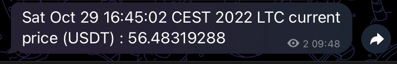

# Token price - BOT Telegram
This project allows you to get the price of famous crypto currencies on telegram if the price goes above a certain value  
You can choose the crypto and choose the value !

There is also a daily recap at 23:59 each day  
All price values are logged into a log file called script_ltc_log

# Bot Configuration 
Clone this repo :
```
git clone <repo_url>
```

Enable script execution :
```
chmod u+x script.sh
```

Then run script.sh : 
```
./script.sh
```

SetUp a bot on Telegram by using @BotFather
Create a new public group and add the bot.  
Request the API :[https://api.telegram.org/bot<YourBOTToken>/getUpdates](https://api.telegram.org/bot<YourBOTToken>/getUpdates)
And get your chat_id.
  
In telegram_bot.sh edit $BOT_TOKEN and $GROUP_ID with YOUR OWN values.

# Linux / Cron Job configuration

On your linux instance, after cloning this repo you can setup a cron job to get Telegram notification every min if you want.
Go into the project folder and run :
```
$ crontab –e
```
In the crontab terminal edit and write :
```
* * * * * <PATH_TO_script.sh>
```
Close the terminal and you should get a sucess message.
```
> crontab: installing new crontab
```
Done !

# Example

Here is an example for Litecoin (LTC), with a telegram message trigger when the price is above 50 $ :  
Open the file called "log_exemple.txt", to show what the log file looks like.  
(Please ignore the time on this example)




